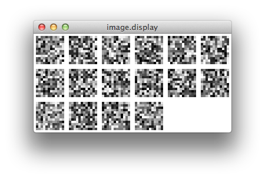
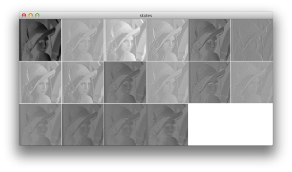
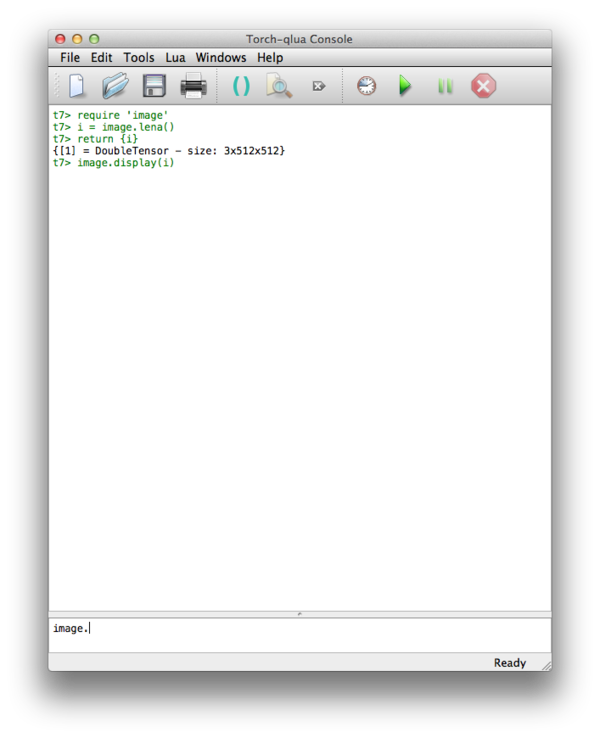

Getting Started with Torch
==========================

Torch7 provides a Matlab-like environment for state-of-the-art machine
learning algorithms. It is easy to use and provides a very efficient 
implementation, thanks to an easy and fast scripting language,
[Lua](http://www.lua.org/) and an underlying C/OpenMP/CUDA implementation.

Torch7 is developed at 
[Idiap Research Institute](http://www.idiap.ch/), 
[New York University](http://www.cs.nyu.edu/~yann/) and
[NEC Laboratories America](http://www.nec-labs.com/). 

At this time, Torch7 is maintained by 
[Ronan Collobert](http://ronan.collobert.com/), 
[Clement Farabet](http://www.clement.farabet.net/)
and 
[Koray Kavukcuoglu](http://koray.kavukcuoglu.org/).
We also use the Qt <-> Lua interface from 
[Leon Bottou](http://leon.bottou.org/).

Installing Torch
----------------

For these tutorials, we assume that Torch is already installed, as well as extra
packages (_image_, _nnx_, _unsup_). If you want to install Torch on your machine, follow
the instructions available [here](http://www.torch.ch/manual/install/index). A
more condensed version can also be found [here](http://code.cogbits.com/).

Running Code
------------

Torch7 is interpreted, so the easiest way to get started is to start an
interpreter, and start typing commands:

```bash
$ torch
Try the IDE: torch -ide
Type help() for more info
Torch 7.0  Copyright (C) 2001-2011 Idiap, NEC Labs, NYU
Lua 5.1  Copyright (C) 1994-2008 Lua.org, PUC-Rio
```

```lua
t7> a = 10
t7> =a
10
t7> print 'something'
something
t7> = 'something'
something
t7> 
```

By default, the interpreter preloads the torch and plotting packages. Extra
packages, such as image, and nn, must be required manually:

```lua
t7> require 'nn'
t7> require 'image'
```

The image package allows easy rendering of images:

```lua
t7> i = image.lena()
t7> image.display(i)
```


In these tutorials, we'll be interested in visualizing internal states, and
convolution filters:

```lua
t7> n = nn.SpatialConvolution(1,16,12,12)
t7> image.display{image=n.weight, padding=2, zoom=4}
```



```lua
t7> n:forward(image.rgb2y(i))
t7> image.display{image=n.output, padding=2, zoom=0.25, legend='states'}
```



Note: most functions in Torch support named arguments. In the example above, 
image.display can be called with arguments in order, or named. When using named
arguments, notice that we replace the parenthesis by curly brackets. Curly
brackets are used to describe Lua's most general data type: the table.

A more advanced, graphical interpreter can be launched like this:

```bash
$ torch -ide
```



This console has better support for history, and completion.

Last, but not least, you can of course save code to a file, which should use
the .lua extension, and execute it either from your shell prompt, or from
the Torch interpreter. All the code in this file has been written to a file
called [getstarted.lua](./getstarted.lua). You can run it like this:

```bash
$ torch getstarted.lua
```

or from the Torch interpreter:

```lua
t7> dofile 'getstarted.lua'
```

More exhaustive information can be found in this
[basic tutorial section](http://www.torch.ch/manual/tutorial/index). In
particular a very quick [Lua primer](http://www.torch.ch/manual/tutorial/index#lua_basics),
a fast intro to [Torch types](http://www.torch.ch/manual/tutorial/index#torch_basicsplaying_with_tensors),
and a very simple introduction to [neural network training](http://www.torch.ch/manual/tutorial/index#exampletraining_a_neural_network).

Getting help
------------

Torch's documentation is work in progress, but you can already get help for most function 
provided in the official packages (_torch_, _nn_, _gnuplot_, _image_). Documentation
is installed on your machine, along with Torch's packages. The default location is 
[/usr/local/share/torch/html/index.html](file:///usr/local/share/torch/html/index.html). It
is also mirrored online [here](http://www.torch.ch/manual), and can be triggered from
your interpreter by doing:

```lua
t7> browse()
```

Now a quick way to learn functions, and explore packages, is to use TAB-completion, that is,
start typing something in the Torch interpreter, and then hit TAB twice:

```lua
t7> torch. + TAB
torch.ByteTensor.            torch.include(
torch.CharStorage.           torch.initialSeed(
torch.CharTensor.            torch.inverse(
...
```

This will give you a list of all functions provided in the _torch_ package. You can then
get inline help for a specific function like this:

```lua
t7> help(torch.randn)

+++++++++++++++++++++++++++++++++++++++++++++++++++++++++++++++++++++
[res] torch.randn( [res,] m [, n, k, ...])       
 y=torch.randn(n) returns a one-dimensional tensor of size n filled 
with random numbers from a normal distribution with mean zero and variance 
one.
 y=torch.randn(m,n) returns a mxn tensor of random numbers from a normal 
distribution with mean zero and variance one.
+++++++++++++++++++++++++++++++++++++++++++++++++++++++++++++++++++++
```

Going Further
-------------

Now that you have all the basic pieces, I invite you to take a look at Torch's
[basic tutorial/introduction](http://www.torch.ch/manual/tutorial/index). In
particular, take a look at: 

  * a very quick [Lua primer](http://www.torch.ch/manual/tutorial/index#lua_basics),
  * a fast intro to [Torch types](http://www.torch.ch/manual/tutorial/index#torch_basicsplaying_with_tensors),
  * a very simple introduction to [neural network training](http://www.torch.ch/manual/tutorial/index#exampletraining_a_neural_network).

The Torch core is a general numeric library, and although most early packages were
built around neural network training, lots of 3rd packages have developed that
provide code for all sorts of things, including image processing, video processing,
graphical models (CRFs, ...), parallel computing, camera interfaces, ... A complete
list of packages we support can be found [here](http://code.cogbits.com/packages/).
Torch has a built-in package management system that makes it very easy for anyone
to get and develop new packages, which can be shared easily, using, for example 
[GitHub](https://github.com/) as a distribution platform. More details about this
[here](http://www.torch.ch/manual/install/index#the_torch_package_management_system).
